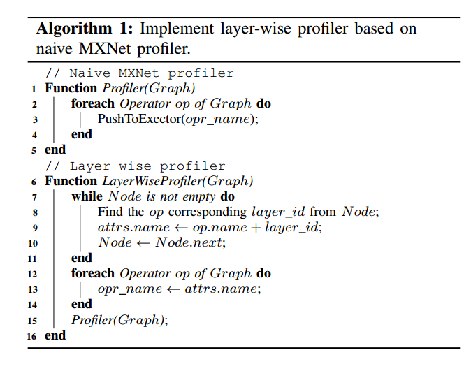
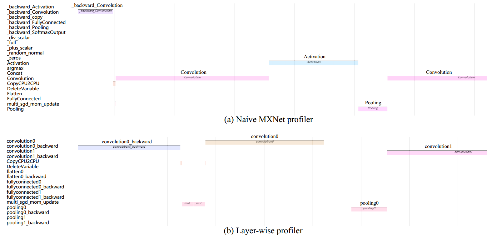
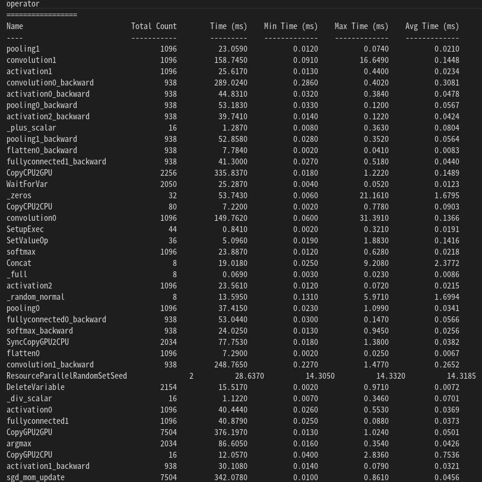
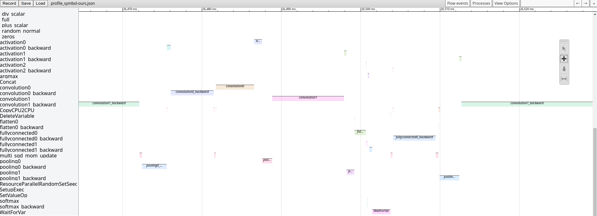

# Layer-Wise Profiler

This repository is the implementation of our layer-wise profiler. Other code about emulation will be publicly available soon.

## Running

Our layer-wise profiler is based on [MXNet 1.4.1](https://github.com/apache/incubator-mxnet.git). You should download MXNet source code and apply the patch in this repository to the MXNet source code.

1. Download the MXNet source.
    ```bash
    git clone https://github.com/apache/incubator-mxnet.git
    ```
1. apply the patch file the MXNet source code.
    ```bash
    cd incubator-mxnet
    git checkout 1.4.1
    git apply 0001-layer-wise-profiler.patch
    ```
3. build and install MXNet follow the [Building From Source](https://mxnet.apache.org/get_started/build_from_source) guide.

## Approach



As illustrated in Algorithm 1, our layer-wise profiler uses the operator name (op:name) and layer name (layer id) to record the operator execution. The operator name (e.g., Convolution, Pooling, and FullyConnected) is usually registered with NNVM. One of the biggest improvements brought by NNVM is the operator attribute system, and we can register attributes with any key (e.g., layer name) to any operators. In line 9, the operator attribute system uses attrs:name to store layer name and operator name together. With this feature, we can profile the same operators but in different layers.

## Usage



Our layer-wise profiler requires no changes to the users' code. You should enable profiler follow the [Profiling Guide](https://mxnet.apache.org/versions/1.9.0/api/python/docs/tutorials/performance/backend/profiler.html)

1. View in console
    ```python
    profiler.set_state('run')
    profiler.set_state('stop')
    print(profiler.dumps())
    ```
    
2. View in browser
    ```python
    profiler.dump(finished=False)
    ```
    
